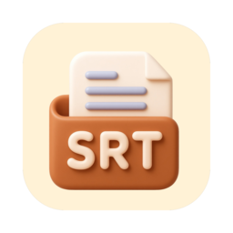
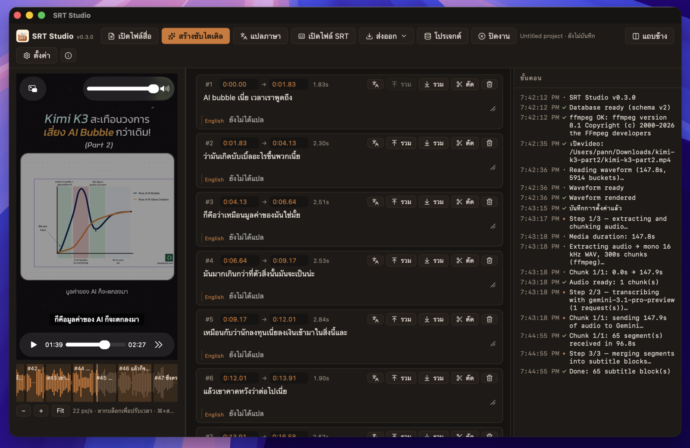

<div align="center">



<h1>SRT Studio</h1>

<p>
<b>SRT Studio</b> transcribes video and audio with Gemini, then lets you edit, retime and
translate the subtitles — and exports <code>.srt</code> in as many languages as you like.
</p>

<p>


<a href="https://github.com/pannks/srt-editor/releases"></a>
<a href="https://github.com/pannks/srt-editor/releases"></a>


</p>

> A local-first desktop subtitle editor — transcribe, retime, translate, export.



</div>

Built with Tauri v2, React 19 and TypeScript, managed with [bun](https://bun.sh).

## Repository layout

| Path | What it is |
| --- | --- |
| [`srt-editor/`](srt-editor/) | The application. Frontend in `src/`, Rust backend in `src-tauri/`. |
| [`workflow/`](workflow/) | Agent coordination layer — project context, task board, learned rules. |
| [`AGENTS.md`](AGENTS.md) | Start here if you are an AI agent. |
| [`docs/`](docs/) | README artwork. |
| `testing-file/` | Local media for manual testing. Not committed. |

## Download

Prebuilt bundles are on the [releases page](https://github.com/pannks/srt-editor/releases):

| Platform | File |
| --- | --- |
| macOS, Apple silicon | `srt-editor_<version>_aarch64.dmg` |
| macOS, Intel | `srt-editor_<version>_x64.dmg` |
| Windows, x64 | `srt-editor_<version>_x64-setup.exe` (or the `.msi`) |

The **Windows** installer bundles `ffmpeg` and `ffprobe` — nothing to install. On **macOS** they
still have to be on the system (`brew install ffmpeg`); the app shells out to them to decode audio.
The builds are unsigned, so the first launch needs right-click › *Open* on macOS, or SmartScreen ›
*More info* › *Run anyway* on Windows.

The bundled Windows `ffmpeg`/`ffprobe` are a GPL build (from
[BtbN/FFmpeg-Builds](https://github.com/BtbN/FFmpeg-Builds), includes libass for burned captions).
SRT Studio's own code stays MIT; the bundled ffmpeg binaries remain under the GPL, and their source
is available from that project.

## Requirements

For building from source:

- [bun](https://bun.sh)
- Rust toolchain (for Tauri)
- `ffmpeg` and `ffprobe` on the system — `brew install ffmpeg`
- A Gemini API key, entered in the app's Settings and stored locally. It is never written to this repository.

Building a **Windows** bundle locally also needs the ffmpeg sidecars fetched first (CI does this
automatically):

```powershell
srt-editor/src-tauri/scripts/fetch-ffmpeg-win.ps1
```

## Run

```bash
cd srt-editor
bun install
bun run tauri dev
```

## Test and build

```bash
cd srt-editor
bun run test                        # vitest unit tests (pure logic)
bun run build                       # tsc + vite production build
bun run tauri build --bundles app   # macOS .app bundle
cargo check --manifest-path src-tauri/Cargo.toml
```

## How it works

1. **Open media** — native file dialog; the file plays in the app and wavesurfer renders its waveform.
2. **Generate SRT** — Rust runs ffmpeg to extract a mono 16 kHz WAV and split it into chunks (default 300 s), then POSTs each chunk to Gemini with a JSON response schema of `[{start, end, text}]`. The request runs in Rust rather than the webview because the inline audio is several megabytes, which macOS WKWebView's `fetch` rejects. Segment times are offset by each chunk's start and merged into blocks. Every step is logged in the Process panel.
3. **Edit blocks** — inline text editing, merge with previous, merge with next, cut at a word boundary, delete.
4. **Retime blocks** — scrub or type into the timecode fields, or drag the block's region on the waveform. Neighbours ripple out of the way so cues never overlap.
5. **Translate** — blocks are sent in batches to a local OpenAI-compatible server (Ollama, LM Studio) or a cloud model (Anthropic, OpenAI, Gemini), each request carrying the neighbouring lines as context. Every block can hold a translation per language.
6. **Preview** — the block under the playhead is drawn over the video, with each language on its own line. A layout toggle moves the player into a side column, which suits 9:16 video.
7. **Export** — standard SubRip output, one file per language, translation-only or stacked over the original. "Open SRT" loads an existing subtitle file to edit, with or without media.
8. **Projects** — media, blocks, translations and settings live in a local SQLite database, and a whole project can be written out as a single `.srtproj` file.

The interface itself is available in English and Thai (Settings › General).

For the full feature detail see [`srt-editor/README.md`](srt-editor/README.md); for architecture see [`workflow/CONTEXT.md`](workflow/CONTEXT.md).

## Contributing

Read [`AGENTS.md`](AGENTS.md). A change is done when `bun run test`, `bun run build` and `cargo check` all pass.

## License

[MIT](LICENSE).
